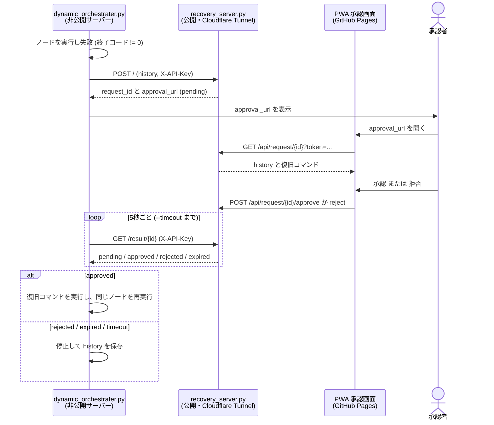
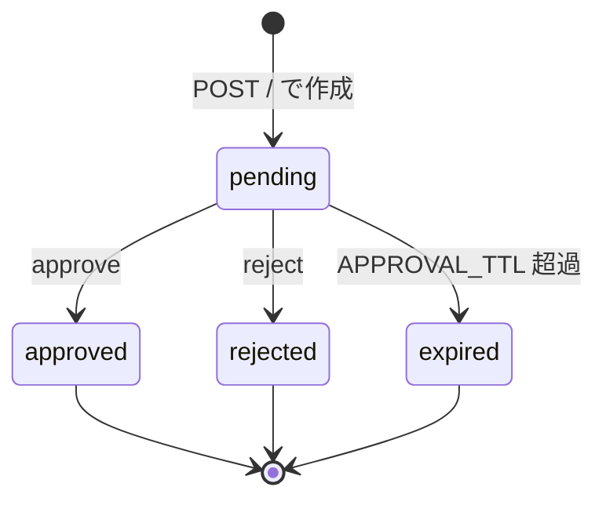

# gromacs-master_v2

GROMACS の分子動力学シミュレーションを、JSON で定義した**ノードのグラフ**として順番に実行するオーケストレーターです。
ノードが失敗したとき、**人間の承認を挟んで**復旧コマンドを実行し、同じノードをやり直せます。

- ノードとその遷移を JSON (plan) で宣言する
- 失敗したら履歴を復旧サーバーへ送り、スマホ等の PWA で承認してから復旧コマンドを実行する
- 実行結果はすべて history / log として JSON に残る


## ファイル構成

| ファイル | 役割 |
|---|---|
| `createplan.py` | テンプレートの `{PATH}` などを対話入力で埋めて plan を生成する |
| `static_orchestrater.py` | plan を順に実行する。失敗したらそこで停止する |
| `dynamic_orchestrater.py` | 失敗時に復旧サーバーへ問い合わせ、承認されたら復旧コマンドを実行して再試行する |
| `recovery_server.py` | 復旧コマンドの承認要求を受け付ける Flask サーバー |
| `templates/example1.json` | タンパク質系の平衡化から本番MD・解析までのテンプレート |

承認画面(PWA)は別リポジトリ [recovery_approval-v1](https://github.com/nakamura26002002921-a11y/recovery_approval-v1) にあります。

## 必要なもの

- Python 3.9 以上
- GROMACS(`gmx` が実行できること)
- 承認画面をスマホで開く場合は HTTPS 公開の手段(Cloudflare Tunnel など)

```bash
pip install -r requirements.txt
```

`utils/call_llm.py` を使う場合のみ、別途 `pip install groq` が必要です。

## 使い方

### 1. plan を作る

テンプレート中の `{...}` を対話入力で埋めます。

```bash
python3 createplan.py -t templates/example1.json -o plans/example.json
```

`example1.json` で入力するパラメータは次の 7 つです。

| パラメータ | 意味 |
|---|---|
| `PATH` | 作業ディレクトリ |
| `PDBID` | RCSB から取得する PDB ID |
| `GMX` | GROMACS の実行コマンド(例: `gmx`) |
| `WATER_MODEL` | `pdb2gmx -water` に渡す水モデル |
| `FORCE_FIELD` | `pdb2gmx -ff` に渡す力場 |
| `DISTANCE` | `editconf -d` に渡すボックス端までの距離 |
| `WATERBOXFILE` | `solvate -cs` に渡す水ボックスのファイル |

### 2. 復旧なしで実行する(static)

```bash
python3 static_orchestrater.py -p plans/example.json
python3 static_orchestrater.py -p plans/example.json -s nvt -e npt_pr
python3 static_orchestrater.py -p plans/example.json -ep /path/to/workdir
```

| オプション | 説明 |
|---|---|
| `-p`, `--plan` | plan の JSON(必須) |
| `-s`, `--start` | 開始ノード(省略時は先頭) |
| `-e`, `--end` | 終了ノード(省略時は末尾) |
| `-ep`, `--executionpath` | コマンドを実行するディレクトリ(省略時はカレント) |
| `--history` | history の出力先(省略時は `histories/<plan名>_<日時>.json`) |
| `-l`, `--logpath` | log の出力先(省略時は `logs/<plan名>_<日時>.json`) |

ノードが 0 以外の終了コードを返すか、`-e` のノードに到達すると停止します。

### 3. 承認つき復旧で実行する(dynamic)

`recovery_server.py` を先に起動してから、`dynamic_orchestrater.py` を実行します。

**復旧サーバー側**

```bash
export RECOVERY_API_KEY="$(openssl rand -hex 32)"
export APPROVAL_URL="https://YOUR-USER.github.io/recovery_approval-v1/"
export APPROVAL_TTL=3600    # 任意。承認の有効期限(秒)
export PUBLIC_URL="https://xxxx.trycloudflare.com"    # 任意。未設定なら受信したリクエストのURLから自動決定
export CORS_ORIGINS="https://YOUR-USER.github.io"     # 任意。未設定なら APPROVAL_URL のオリジンのみ許可
python3 recovery_server.py
cloudflared tunnel --url http://127.0.0.1:5000
```

**オーケストレーター側**

```bash
export RECOVERY_API_KEY="サーバーと同じ値"    # 環境変数で渡す(--api-key は ps に見えるため非推奨)
python3 dynamic_orchestrater.py -p plans/example.json --recovery-url https://xxxx.trycloudflare.com
```

static の引数に加えて、次のオプションがあります。

| オプション | 既定値 | 説明 |
|---|---|---|
| `--recovery-url` | 空 | 復旧サーバーの URL。省略すると復旧なし(失敗で停止) |
| `--api-key-file` | 空 | APIキーを書いたファイル(先頭1行)。`chmod 600` 推奨 |
| `--api-key` | 空 | 非推奨。`ps` やシェル履歴にキーが残る。環境変数 `RECOVERY_API_KEY` を優先して使う |
| `--max-retries` | `3` | 同じノードで復旧を試みる上限回数。次のノードへ進むとリセットされる |
| `--timeout` | `3600` | 承認待ちを打ち切るまでの秒数 |

## 復旧フロー

失敗したノードの履歴がサーバーに送られ、承認者が画面で内容を確認して承認または拒否します。



承認要求は次の状態を持ちます。`pending` のときだけ承認・拒否でき、それ以外に操作すると HTTP 409 を返します。



停止する条件は次のとおりです。

- 復旧コマンドが `rejected` / `expired` / `timeout` になった
- 復旧コマンドの実行が失敗した
- `--max-retries` に達した

## 承認フローと安全設計

非公開サーバー(`dynamic_orchestrater.py`)は外向きの通信しかできない前提で、公開サーバー(`recovery_server.py`)を中継にして、承認者(PWA)の承認を得てから復旧コマンドを実行します。

```
非公開サーバー ──(1)履歴をPOST──▶ 公開サーバー ◀──(3)承認/拒否── 承認者(PWA)
      │  ◀─(4)承認状態をポーリング──     │  ──(2)承認URLを返す──▶ (承認者へURLを共有)
      └─(5)承認済みなら、内容を検証して実行
```

非公開サーバーから公開サーバーへの通信だけで完結し、公開サーバーから非公開サーバーへの接続は不要です。

### APIキーの渡し方

`--api-key` は `ps` やシェル履歴にキーが残るため非推奨です。次のいずれかを使います。優先順位は 1 > 2 > 3 です。

1. 環境変数: `export RECOVERY_API_KEY="..."`
2. キーファイル: `--api-key-file ~/.recovery_key`(先頭1行がキー。`chmod 600` 推奨。権限が緩いと警告)
3. `--api-key "..."`(警告が出ます)

`--recovery-url` を指定しない場合は復旧機能を使わないので、キーは不要です。

### 鍵と権限の分離

| 鍵 | 持つ人 | できること |
|---|---|---|
| APIキー(`RECOVERY_API_KEY`) | 非公開サーバー・公開サーバー | 承認要求の作成、承認結果の取得 |
| 承認トークン(承認URLの `#token=`) | 承認者(PWA) | その1件の承認要求の確認・承認・拒否のみ |

- PWA は APIキーを持ちません。承認トークンでは結果取得(`/result`)はできず、APIキーでは承認できません。
- 承認トークンはURLの `#` 以降(フラグメント)に入ります。フラグメントは GitHub Pages 等のサーバーに送信されず、Referer にも載りません。PWA は読み取り後にアドレスバーから消します。
- キー・トークンの比較は定数時間で行います。

### 承認は「見たコマンド」に束縛される

- PWA は表示したコマンドの SHA-256(`command_hash`)を承認時に送ります。ハッシュが一致しないと承認できません(`hash_mismatch`)。
- 非公開サーバーは、実行の直前にコマンドとハッシュの整合性を再検証し、一致しなければ実行せずに停止します。
- 承認済みコマンドは1回しか取得できません(2回目は HTTP 410 `consumed`)。
- 承認トークンを5回間違えると、その承認要求はロックされます(HTTP 429)。誤トークンを送るだけで承認を妨害できますが、その場合コマンドは実行されない側(安全側)に倒れます。

### 限界(守れないもの)

- **公開サーバー自体が乗っ取られた場合**、攻撃者はコマンドとそのハッシュの両方を差し替えられます。非公開サーバー側で検出することはできません。公開サーバーは信頼できる環境で運用し、APIキーを定期的に更新してください。
- **承認者の端末が乗っ取られている場合**、承認画面の表示自体を信用できません。
- `pending_requests` はメモリ上にしかないので、公開サーバーを再起動すると承認待ちの要求は失われます(その場合は非公開サーバー側が承認待ちのタイムアウトで停止します)。

## 終了コード

`static_orchestrater.py` と `dynamic_orchestrater.py` は、シェルスクリプトや CI から呼び出しても成否が判別できるよう、次の終了コードを返します。

| 終了コード | 意味 |
|---|---|
| `0` | 最後のノード(または `-e` で指定したノード)まで成功した |
| `1` | ノードの失敗、復旧の拒否・期限切れ・タイムアウト、リトライ上限、plan の検証エラーなどで止まった |
| `130` | `^C` で中断した(history は保存される) |

実行前に plan を検証します。`-s` / `-e` に存在しないノード名を指定した場合、「次のノード」が plan にない場合、`実行コマンド` / `目的` がないノードがある場合は、コマンドを実行せずにエラーで終了します。

## 出力ファイル

history と log は同じ内容の JSON 配列です。1 コマンドにつき 1 要素で、復旧コマンドも同じ形式で追記されます。

```json
{
  "ノード": "nvt",
  "実行コマンド": "...",
  "目的": "NVT平衡化を実行する",
  "出力": "...",
  "エラー": "...",
  "終了コード": 0
}
```

`^C` で中断した場合は `終了コード` が `-2` になり、それまでの history も保存されます。

## 注意事項

- **コマンドは `shell=True` で実行されます。** plan と、承認した復旧コマンドは、承認者が全文を読んだ上で実行してください。信頼できない plan は実行しないでください。
- 現在の `recovery_server.py` が返す復旧コマンドは `echo recovery` の固定値です。動作確認用で、実際の復旧処理は行いません。
- 承認 URL には `api=`(復旧サーバーの公開 URL)が自動で付与され、承認画面はそこへ接続します。`PUBLIC_URL` を設定した場合はその値が使われます。
- 復旧サーバーは、承認画面のオリジン(既定は `APPROVAL_URL` のオリジン、`CORS_ORIGINS` で変更可)からのブラウザアクセスだけを許可します。
- 復旧サーバーは、空・不正な形式の history を受け取ると HTTP 400 を返します。
- `createplan.py` は、入力値に `"` や `\` が含まれていても JSON が壊れないようエスケープして埋め込みます。
- 履歴はリクエストボディで送信するため、出力が大きくても送信できます(以前の `curl` 引数渡しでは約128KBで失敗していました)。
- 承認要求はメモリ上に保持されるため、サーバーを再起動すると消えます。
- `recovery_server.py` は Flask の開発サーバーで動きます。長期運用する場合は gunicorn などを使ってください。
- 承認 URL にはトークンが含まれます。他人に共有しないでください。
- `example1.json` の `ref_p = 560` や本番MDの `nsteps = 50000000`(100 ns)は、用途に合わせて確認してください。
